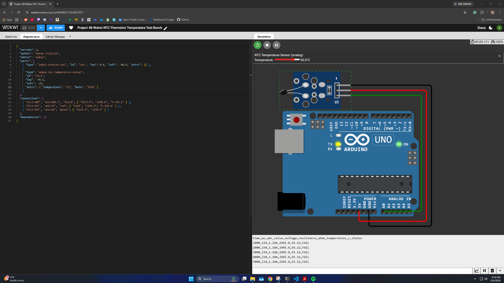
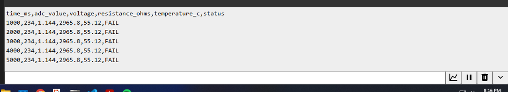
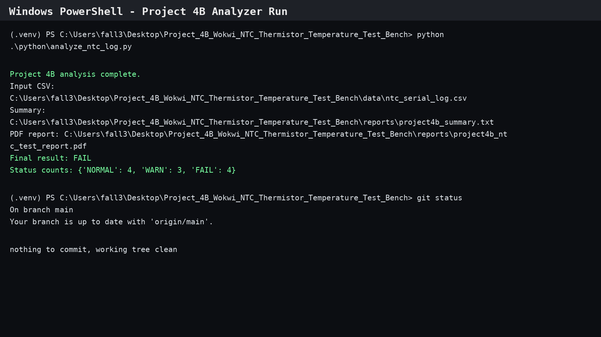
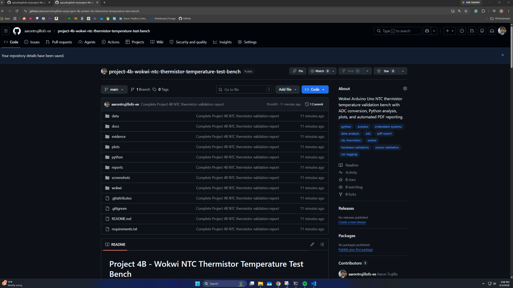
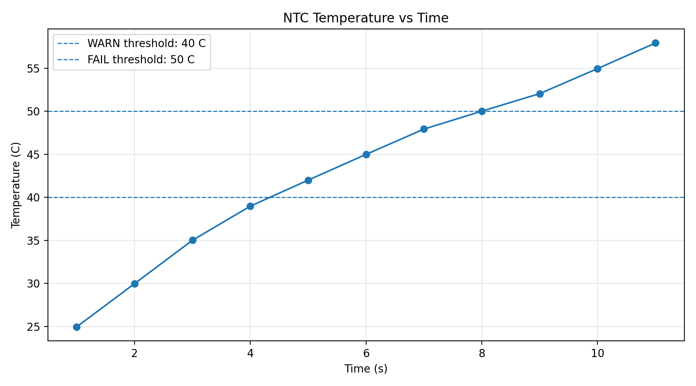
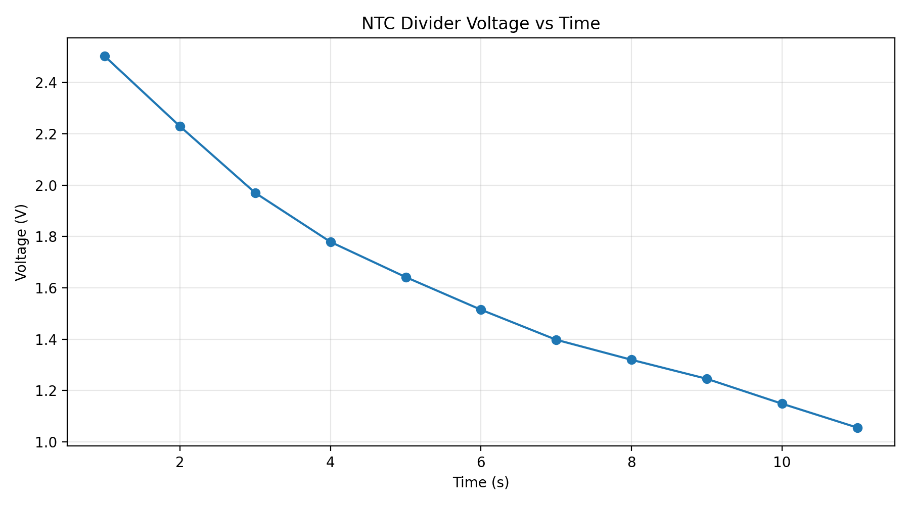
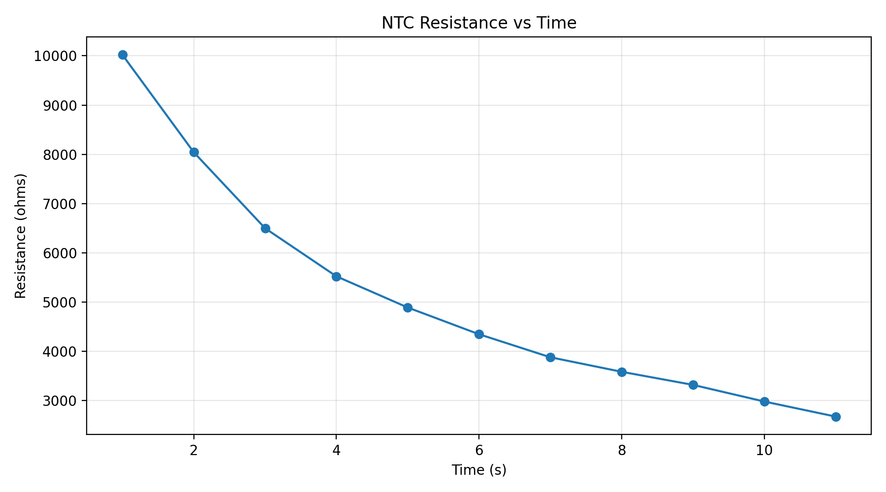

# Project 4B — Wokwi NTC Thermistor Temperature Test Bench


## Overview

Project 4B is a simulated embedded temperature validation bench built in **Wokwi** using an **Arduino Uno** and an **NTC thermistor temperature sensor model**.

This project upgrades my Project 4A ADC validation workflow from a simple potentiometer input into a more realistic sensor validation workflow using:

* Arduino ADC readings
* Voltage-divider analysis
* NTC thermistor resistance calculation
* Beta-equation temperature conversion
* NORMAL / WARN / FAIL threshold classification
* Serial CSV logging
* Python data analysis
* Automated plots
* Automated PDF engineering report generation
* GitHub documentation

The full workflow is designed to demonstrate the kind of process used in hardware test, validation engineering, embedded systems, and Python-based test automation.

---

## Quick Results

| Metric                  |                            Result |
| ----------------------- | --------------------------------: |
| Samples analyzed        |                                11 |
| Minimum temperature     |                           24.96°C |
| Maximum temperature     |                           57.94°C |
| Average temperature     |                           43.53°C |
| NORMAL samples          |                                 4 |
| WARN samples            |                                 3 |
| FAIL samples            |                                 4 |
| Final validation result | FAIL condition detected correctly |

> **Important:** `FAIL` does **not** mean the project failed.
> It means the test dataset intentionally included over-temperature samples above 50°C, and the validation logic correctly detected the fault condition.

---

## Live Wokwi Simulation

The Wokwi simulation is available here:

https://wokwi.com/projects/466046213563687937

Relevant Wokwi files:

```text
wokwi/sketch.ino
wokwi/diagram.json
```

The simulation includes an Arduino Uno connected to a Wokwi NTC analog temperature sensor. The Arduino reads the sensor output on analog pin A0, converts the ADC value to voltage, estimates thermistor resistance, calculates temperature using the Beta equation, and classifies each reading as `NORMAL`, `WARN`, or `FAIL`.

---

## Engineering Workflow

```text
NTC Thermistor Sensor
        ↓
Arduino ADC Reading
        ↓
Voltage Calculation
        ↓
Thermistor Resistance Calculation
        ↓
Beta Equation Temperature Estimate
        ↓
NORMAL / WARN / FAIL Classification
        ↓
Serial CSV Logging
        ↓
Python Analysis
        ↓
Plots + Summary + PDF Engineering Report
```

Project 4A workflow:

```text
Potentiometer → Arduino ADC → Voltage → NORMAL/WARN/FAIL → Python Report
```

Project 4B workflow:

```text
NTC Thermistor → Arduino ADC → Voltage → Resistance → Temperature → NORMAL/WARN/FAIL → Python Report
```

Full engineering workflow:

```text
Circuit Simulation
→ ADC Conversion
→ Thermistor Resistance Calculation
→ Temperature Calculation
→ Validation Logic
→ CSV Logging
→ Python Analysis
→ Plots
→ PDF Engineering Report
→ GitHub Documentation
```

---

## Engineering Goal

The goal is to validate whether a simulated temperature sensor is operating inside expected limits.

| Status | Temperature Condition     |
| ------ | ------------------------- |
| NORMAL | temperature < 40°C        |
| WARN   | 40°C ≤ temperature < 50°C |
| FAIL   | temperature ≥ 50°C        |

The final result uses worst-case logic:

```text
FAIL overrides WARN.
WARN overrides NORMAL.
NORMAL is only final if every sample is normal.
```

This means a final result of `FAIL` is correct when any sample crosses the fail threshold.

---

## Hardware / Simulation Setup

The Wokwi simulation uses:

* Arduino Uno
* Wokwi NTC analog temperature sensor
* Analog input pin A0
* 5 V reference
* Ground
* Serial Monitor CSV output

### Connections

| NTC Sensor Pin | Arduino Uno Pin |
| -------------- | --------------- |
| VCC / +        | 5V              |
| GND / -        | GND             |
| OUT / S        | A0              |

### Conceptual Voltage Divider Model

```text
5V → 10k fixed resistor → A0 / OUT → NTC thermistor → GND
```

With this orientation, higher temperature lowers the NTC resistance, which lowers the measured A0 voltage.

---

## Screenshots

### Wokwi NTC Circuit



### Wokwi Serial Monitor CSV Output



### Python Analyzer Successful Run



### GitHub Repository



---

## Generated Plots

### Temperature Plot



### Voltage Plot



### Resistance Plot



---

## Generated Evidence

The Python analyzer generates:

```text
plots/ntc_temperature_plot.png
plots/ntc_voltage_plot.png
plots/ntc_resistance_plot.png

reports/project4b_summary.txt
reports/project4b_ntc_test_report.pdf

evidence/project4b_report_final_run.pdf
evidence/project4b_summary_final_run.txt
evidence/ntc_temperature_plot_final_run.png
evidence/ntc_voltage_plot_final_run.png
evidence/ntc_resistance_plot_final_run.png
```

---

## NTC Thermistor Theory

An NTC thermistor has resistance that decreases as temperature increases.

This project uses a simulated:

```text
10kΩ nominal NTC thermistor at 25°C
Beta coefficient: 3950
```

As temperature increases:

```text
Temperature increases
→ NTC resistance decreases
→ A0 voltage decreases
→ ADC value decreases
```

The final validation data confirms this behavior:

| Temperature | ADC Value | Voltage | Resistance |
| ----------: | --------: | ------: | ---------: |
|     24.96°C |       512 | 2.502 V |  10019.6 Ω |
|     45.00°C |       310 | 1.515 V |   4347.8 Ω |
|     55.12°C |       234 | 1.144 V |   2965.8 Ω |

---

## ADC Conversion

The Arduino Uno ADC is treated as a 10-bit converter.

```text
voltage = adc_value × 5.0 / 1023.0
```

Where:

| Term      | Meaning                         |
| --------- | ------------------------------- |
| adc_value | Arduino `analogRead(A0)` result |
| 5.0       | Reference voltage               |
| 1023.0    | Maximum 10-bit ADC count        |

---

## Resistance Calculation

For the voltage divider orientation used in this project:

```text
resistance_ntc = fixed_resistor × voltage / (5.0 - voltage)
```

Where:

| Term           | Meaning                             |
| -------------- | ----------------------------------- |
| fixed_resistor | 10000 Ω                             |
| voltage        | Measured A0 voltage                 |
| resistance_ntc | Estimated NTC thermistor resistance |

---

## Temperature Calculation

The Beta equation is used to convert thermistor resistance into temperature.

```text
1/T = 1/T0 + (1/B) × ln(R/R0)
```

Where:

| Term | Meaning                        |
| ---- | ------------------------------ |
| T    | Temperature in Kelvin          |
| T0   | 298.15 K                       |
| R0   | 10000 Ω                        |
| B    | 3950                           |
| R    | Measured thermistor resistance |

Then temperature is converted from Kelvin to Celsius:

```text
temperature_c = temperature_k - 273.15
```

---

## Pass / Warn / Fail Logic

The Arduino classifies each reading using this logic:

```text
NORMAL: temperature < 40°C
WARN:   40°C ≤ temperature < 50°C
FAIL:   temperature ≥ 50°C
```

The Python analyzer counts each status and reports the worst observed state as the final result.

---

## Final Validation Dataset

The final dataset includes NORMAL, WARN, and FAIL samples across a temperature sweep.

| time_ms | adc_value | voltage | resistance_ohms | temperature_c | status |
| ------: | --------: | ------: | --------------: | ------------: | ------ |
|    1000 |       512 |   2.502 |         10019.6 |         24.96 | NORMAL |
|    2000 |       456 |   2.229 |          8042.3 |         29.98 | NORMAL |
|    3000 |       403 |   1.970 |          6500.0 |         35.02 | NORMAL |
|    4000 |       364 |   1.779 |          5523.5 |         38.98 | NORMAL |
|    5000 |       336 |   1.642 |          4890.8 |         42.01 | WARN   |
|    6000 |       310 |   1.515 |          4347.8 |         45.00 | WARN   |
|    7000 |       286 |   1.398 |          3880.6 |         47.94 | WARN   |
|    8000 |       270 |   1.320 |          3585.7 |         50.02 | FAIL   |
|    9000 |       255 |   1.246 |          3320.3 |         52.06 | FAIL   |
|   10000 |       235 |   1.149 |          2982.2 |         54.97 | FAIL   |
|   11000 |       216 |   1.056 |          2676.6 |         57.94 | FAIL   |

---

## Final Test Results

| Metric              |     Value |
| ------------------- | --------: |
| Samples analyzed    |        11 |
| NORMAL count        |         4 |
| WARN count          |         3 |
| FAIL count          |         4 |
| Minimum temperature |   24.96°C |
| Maximum temperature |   57.94°C |
| Average temperature |   43.53°C |
| Minimum voltage     |   1.056 V |
| Maximum voltage     |   2.502 V |
| Minimum resistance  |  2676.6 Ω |
| Maximum resistance  | 10019.6 Ω |
| Final result        |      FAIL |

The final result is `FAIL` because the dataset intentionally includes samples above 50°C. This confirms the validation system correctly detects an over-temperature condition.

---

## Repository Structure

```text
Project_4B_Wokwi_NTC_Thermistor_Temperature_Test_Bench/
│
├── README.md
├── requirements.txt
├── .gitignore
├── .gitattributes
│
├── wokwi/
│   ├── sketch.ino
│   └── diagram.json
│
├── python/
│   └── analyze_ntc_log.py
│
├── data/
│   ├── sample_ntc_serial_log.csv
│   └── ntc_serial_log.csv
│
├── plots/
│   ├── ntc_temperature_plot.png
│   ├── ntc_voltage_plot.png
│   └── ntc_resistance_plot.png
│
├── reports/
│   ├── project4b_summary.txt
│   └── project4b_ntc_test_report.pdf
│
├── docs/
│   ├── test_plan.md
│   ├── engineering_notes.md
│   └── ntc_formula_notes.md
│
├── evidence/
│   ├── project4b_report_final_run.pdf
│   ├── project4b_summary_final_run.txt
│   ├── ntc_temperature_plot_final_run.png
│   ├── ntc_voltage_plot_final_run.png
│   └── ntc_resistance_plot_final_run.png
│
└── screenshots/
    ├── wokwi_ntc_circuit.png
    ├── wokwi_serial_monitor.png
    ├── python_successful_run.png
    └── github_repo.png
```

---

## How to Run the Python Analyzer

From PowerShell:

```powershell
cd "C:\Users\fall3\Desktop\Project_4B_Wokwi_NTC_Thermistor_Temperature_Test_Bench"

python -m venv .venv
.\.venv\Scripts\Activate.ps1
pip install -r requirements.txt

python .\python\analyze_ntc_log.py
```

Expected output:

```text
Project 4B analysis complete.
Final result: FAIL
Status counts: {'NORMAL': 4, 'WARN': 3, 'FAIL': 4}
```

---

## How to Use the Wokwi Files

1. Open the Wokwi simulation link.
2. Open `sketch.ino` to view or edit the Arduino code.
3. Open `diagram.json` to view or edit the simulated wiring and NTC temperature setting.
4. Run the simulation.
5. Change the NTC temperature value to test NORMAL, WARN, and FAIL conditions.
6. Copy the Serial Monitor CSV output into:

```text
data/ntc_serial_log.csv
```

7. Run the Python analyzer again to regenerate plots and the PDF report.

---

## Manual Wokwi Test Cases

| Test Case | Temperature Setting | Expected Status |
| --------- | ------------------: | --------------- |
| Test 1    |                25°C | NORMAL          |
| Test 2    |                45°C | WARN            |
| Test 3    |                55°C | FAIL            |

Example Wokwi `diagram.json` temperature setting:

```json
"attrs": {
  "temperature": "45",
  "beta": "3950"
}
```

---

## Serial Monitor CSV Format

The Serial Monitor output uses this CSV format:

```text
time_ms,adc_value,voltage,resistance_ohms,temperature_c,status
```

Example:

```text
1000,512,2.502,10019.6,24.96,NORMAL
2000,456,2.229,8042.3,29.98,NORMAL
3000,403,1.970,6500.0,35.02,NORMAL
4000,364,1.779,5523.5,38.98,NORMAL
5000,336,1.642,4890.8,42.01,WARN
6000,310,1.515,4347.8,45.00,WARN
7000,286,1.398,3880.6,47.94,WARN
8000,270,1.320,3585.7,50.02,FAIL
9000,255,1.246,3320.3,52.06,FAIL
10000,235,1.149,2982.2,54.97,FAIL
11000,216,1.056,2676.6,57.94,FAIL
```

---

## What I Learned

This project strengthened my understanding of:

* Modeling an NTC thermistor temperature sensor in Wokwi
* Wiring an analog sensor output to Arduino Uno A0
* Converting Arduino ADC readings into voltage
* Estimating thermistor resistance from a voltage divider
* Using the Beta equation to calculate temperature
* Classifying sensor readings against engineering limits
* Exporting serial data as CSV
* Automating CSV analysis, plots, summaries, and PDF reports with Python
* Documenting an embedded validation workflow in a GitHub repository

---

## Limitations

This project is useful, but it is still simulated. The next version needs real hardware.

Current limitations:

* The project is simulated, not physical hardware.
* The Wokwi NTC model is idealized compared with a real thermistor.
* Real thermistors have tolerance, wiring resistance, ADC noise, self-heating, and calibration error.
* Real hardware validation should include measured reference temperatures and calibration data.
* The current workflow uses a fixed Beta equation model instead of a calibrated Steinhart-Hart model.

---

## Next Upgrade — Project 4C

Project 4C should repeat this same workflow using real hardware:

```text
Real Arduino or Tiva-C board
→ Physical NTC voltage divider
→ ADC reading
→ Serial CSV logging
→ Python analysis
→ Calibration comparison
→ PDF engineering report
```

Possible Project 4C upgrades:

* Real 10k NTC thermistor
* Real 10k fixed resistor voltage divider
* Arduino Uno, Tiva-C, ESP32, or Raspberry Pi Pico ADC input
* Breadboard wiring
* Measured reference temperature comparison
* Calibration offset correction
* Repeated heating and cooling test cycle
* Python report comparing simulated and measured data

---

## Resume Bullet

Developed a simulated embedded temperature validation bench using Wokwi, Arduino Uno ADC logic, NTC thermistor modeling, voltage-divider analysis, Beta-equation temperature conversion, Python CSV analysis, threshold classification, automated plots, and PDF engineering report generation to demonstrate a complete hardware test workflow.

---

## Interview Explanation

After building Project 4A with a potentiometer ADC input, I upgraded the workflow into Project 4B using an NTC thermistor model.

The Arduino reads the analog voltage from a thermistor divider, converts ADC counts to voltage, calculates thermistor resistance, converts resistance into temperature using the Beta equation, and classifies the result as NORMAL, WARN, or FAIL. I then analyze the serial CSV data in Python to generate plots and an engineering PDF report.

This project connects circuit theory, embedded ADC reading, sensor math, validation limits, data logging, automation, and technical documentation.

---

## Key Skills Demonstrated

* Arduino Uno
* Wokwi simulation
* NTC thermistor modeling
* ADC conversion
* Voltage-divider analysis
* Beta equation
* Embedded sensor validation
* Serial CSV logging
* Python data analysis
* Matplotlib plotting
* ReportLab PDF generation
* GitHub documentation
* Hardware test workflow
* Engineering reporting
